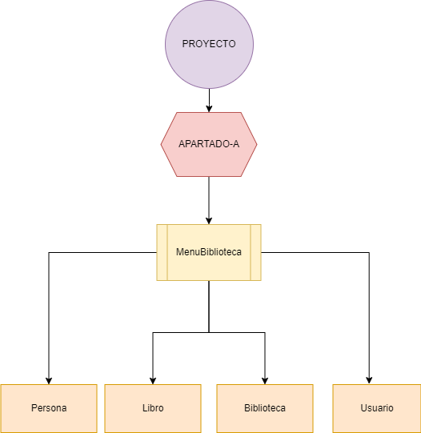
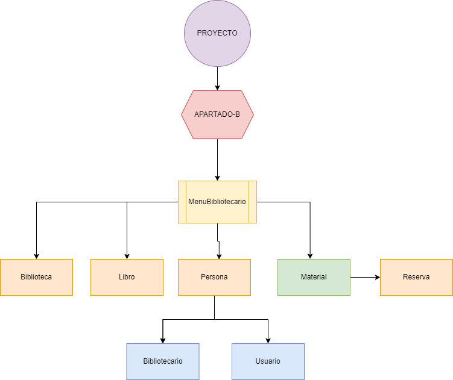

# JavaBiblioteca

> Proyecto encargado de gestionar una biblioteca realizado en Java.

## Tabla de contenidos

1. [Información general](#Información-general)
2. [Implementación](#Implementación)
3. [Esquema del proyecto](#Esquema-del-proyecto)

## Información general

El proyecto consiste en la gestión de una biblioteca, donde se pueden realizar las siguientes acciones:

* Gestionar reservas (realizar reservas y devoluciones).
* Gestionar usuarios (bibliotecarios y usuarios, podrán ser añadidos, eliminados o modificar su contraseña).7
* Gestionar libros (añadir, eliminar o modificar libros).

El trabajo se ha realizado para profundizar más en los aspectos de la programación orientada a objetos, así como en el uso de las colecciones de Java.
Polimorfismo, herencia, interfaces, clases abstractas, colecciones, etc.

## Implementación

Para la implementación y construcción del proyecto se ha utilizao Maven.
El proyecto se divide en dos directorios llamados Apartado-A y Apartado-B, donde cada uno de ellos contiene el proyecto realizado en el apartado correspondiente.

Para reforzar los conocimientos aprendidos en clase se ha intentado aplicar todos los conceptos vistos en el curso, como por ejemplo:

* Uso de interfaces.
* Uso de clases abstractas.
* Uso de colecciones.
* Uso de excepciones.
* Uso de lectura y escritura de ficheros.
* Uso de la programación orientada a objetos.

Para ejecutar el proyecto se debe seguir los siguientes pasos:

1. Descargar el proyecto.   
2. Abrir el proyecto con un IDE (Eclipse, Netbeans, etc).
3. Ejecutar el proyecto.
4. Seleccionar el apartado que se desea ejecutar. (A o B y dentro su menú correspondiente).
5. Seleccionar la opción deseada.
6. Introducir los datos que se solicitan.
7. Repetir los pasos 5 y 6 hasta que se desee salir del programa.

## Esquema del proyecto

Apartado A:

Apartado B:

